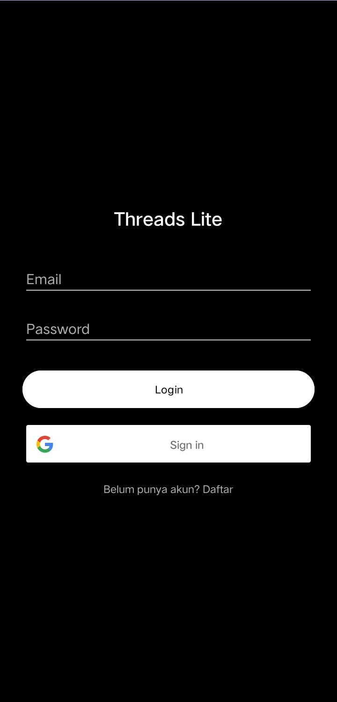
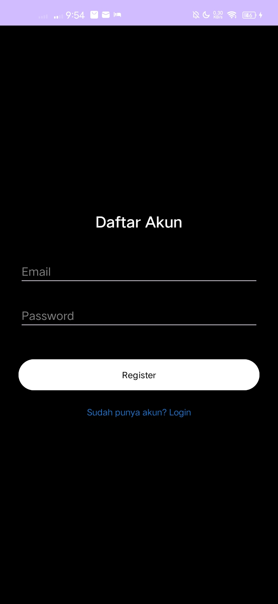
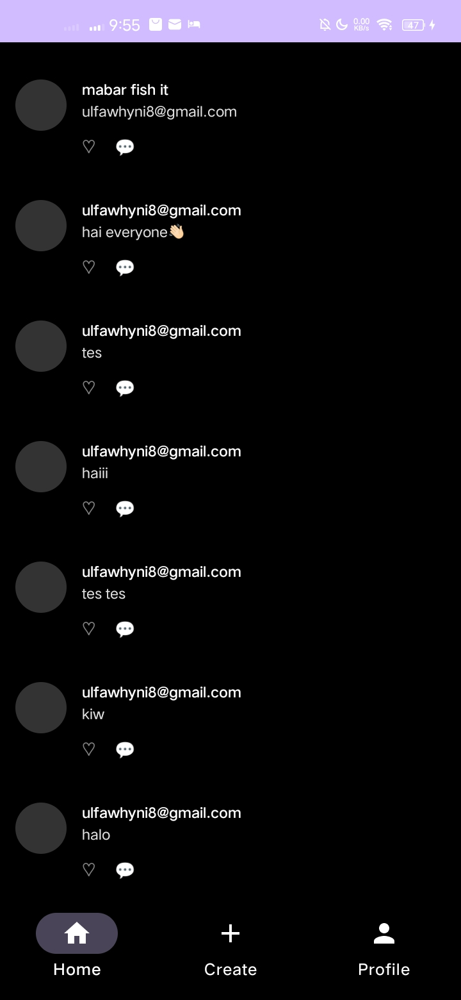
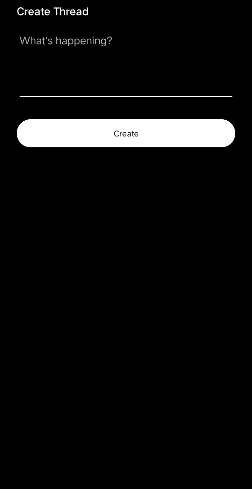
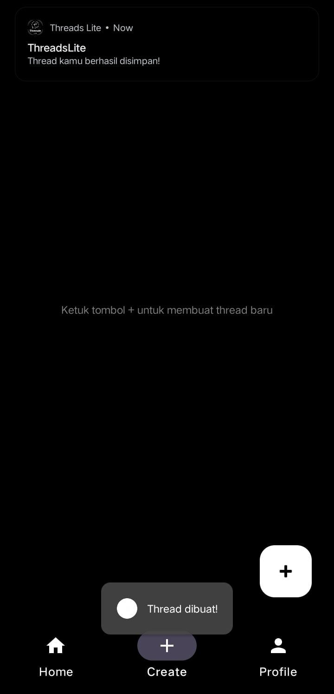

# ThreadsLite - Mobile Application

## Identitas
- **Nama:** [Ulfa Wahyuni]
- **NIM:** [2304411374]
- **Kelas:** [5J RPL GAB 2]

## Tema & Referensi Aplikasi
- **Tema:** Aplikasi Media Sosial (ThreadsLite)
- **Aplikasi Rujukan:** Threads by Instagram
- **Link Play Store:** [https://play.google.com/store/apps/details?id=com.instagram.barcelona]

## Fitur Aplikasi (Ceklist)
- [x] Login
- [x] List Data (Menampilkan postingan/thread)
- [x] Add Data (Membuat postingan baru)
- [x] Edit Data (Mengubah postingan)
- [x] Detail Data (Melihat detail thread)
- [x] Notifikasi (Pemberitahuan notifikasi thread)

## Screenshots Tampilan
| Login | Register | Home | Add |
|---|---|---|
|  |  |  |  |

| Create | Edit/Update | Profil | Notifikasi |
|---|---|---|
|  |  | |  |

## Cara Menjalankan Aplikasi
1. Clone repository ini melalui terminal: `git clone https://github.com/ulfaws/ThreadsLite.git`
2. Buka proyek menggunakan **Android Studio**.
3. Pastikan Gradle sinkronisasi selesai.
4. Jalankan aplikasi menggunakan emulator atau perangkat fisik (Run button).
